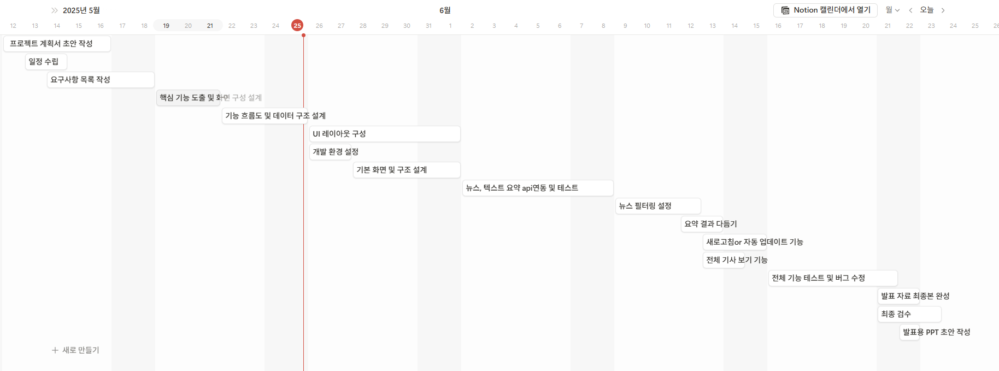

####  프로젝트 계획서

# 1. 프로젝트명
NewsSummary (뉴스 요약 앱)

# 2. 앱 개요
네이버에서 제공하는 뉴스정보를 활용하여 사용자에게 요약된 뉴스를 제공

# 3. 개발 목적
- 요약된 뉴스를 제공하여 사용자의 시간을 절약
- Flutter 및 Dart 언어 개발 능력 향상
- api연동 및 활용 능력 향상

# 4. 주요 기능 정리
- 실시간 뉴스 요약본 제공
- 뉴스 주제별 필터링
- 사용자가 원할시 뉴스 전문 제공

# 5. 개발 환경
- 개발 언어: Dart
- 프레임워크: Flutter
- 개발 환경: Android Studio, Flutter SDK
- API: 네이버 뉴 API, DocSummarizer(텍스트 요약API)

# 6. 개발 일정

# 7. 요구사항 수집 및 분석
  
| 나의 요구사항 | 타인의 요구사항 |
|--------------|-------------|
| 뉴스 필터링(주제별로) | 다크모드 제공 |
| 뉴스 요약 2~3줄로 간결하게 제공 | 특정 키워드 포함시 뉴스 노출 x |
| 원할시 뉴스 원본 링크로 이동 |  |
| 뉴스 필터링(주제별로) |  |

### 사용자 요구사항 정리

| 유형         | 구체적 니즈 |
|--------------|-------------|
| 정보 소비 최적화 | 뉴스를 짧고 빠르게 파악하고 싶음 (시간 부족) |
| 관심 맞춤 제공 | 내가 원하는 분야(정치, 경제, 스포츠 등) 뉴스만 보고 싶음 |
| 콘텐츠 필터링 | 내가 원하지 않는 키워드가 포함시 노출되지 않게 하고싶음 |
| 선택적 심화 | 요약만 보고 전체 내용을 볼지 결정하고 싶음 |
| AI 신뢰성 | AI가 요약한 내용이 정확하고 신뢰할 수 있길 바람 |
| 사용 편의성1 | 복잡한 설정 없이도 쉽게 원하는 뉴스를 확인하고 싶음 |
| 사용 편의성2 | 눈 피로 감소 및 시각적 편안함 제공 |

### 기능 요구사항 도출

| 분류   | 요구사항 | 설명 |
|--------|----------|------|
| 기능   | 뉴스 요약 보기 | AI가 요약한 뉴스를 리스트로 보여줌 |
| 기능   | 전체 뉴스 보기 | 사용자가 원할 때 전체 기사 내용으로 이동 가능 |
| 기능   | 관심 분야 설정 | 정치, 경제, 사회, 스포츠 등 사용자가 분야 선택 가능 |
| 기능   | 최신 뉴스 자동 업데이트 | 실시간 또는 일정 간격으로 뉴스 자동 반영 |
| 기능   | 키워드 강조 | 요약 내 주요 키워드 하이라이팅 |
| 기능   | 검색 기능 | 특정 키워드나 분야로 뉴스 검색 가능 |
| 기능   | 키워드 필터링 | 특정 키워드가 포함시 제공하지않음  |
| 비기능 | 빠른 로딩 속도 | 요약된 뉴스는 최소 데이터로 빠르게 표시 |
| 비기능 | 다크모드 | 눈 피로 감소 및 시각적 편안함 제공 |

### 이를 기반으로 핵심 기능 도정
